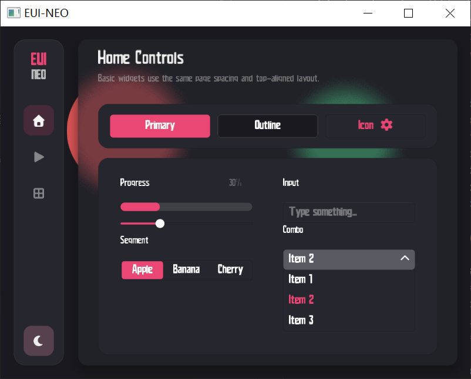
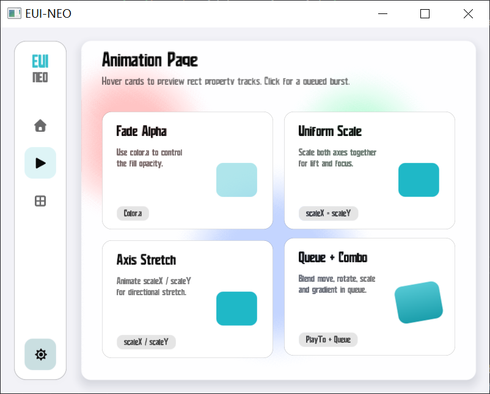

# EUI-NEO

EUI-NEO 是一个基于 OpenGL 的轻量 2D GUI 框架。当前这套渲染模型的核心不是“每个组件各画各的”，而是用少量基础图元统一搭建页面、组件、动画和局部重绘。

<p align="center">
  
  
</p>

## 结构

```text
EUI-NEO/
├─ main.cpp
├─ README.md
├─ font/
├─ src/
│  ├─ EUINEO.h
│  ├─ EUINEO.cpp
│  ├─ components/
│  │  ├─ Panel.*
│  │  ├─ Label.*
│  │  ├─ Button.*
│  │  ├─ ProgressBar.*
│  │  ├─ Slider.*
│  │  ├─ SegmentedControl.*
│  │  ├─ InputBox.*
│  │  └─ ComboBox.*
│  └─ pages/
│     └─ MainPage.*
└─ CMakeLists.txt
```

- `main.cpp`：窗口创建、输入回调、主循环、帧缓存回放、局部重绘调度。
- `src/EUINEO.h` / `src/EUINEO.cpp`：全局状态、渲染器、基础图元、文本绘制、脏区系统、动画轨道。
- `src/components/`：通用组件层，负责交互和组合基础图元。
- `src/pages/`：页面层，负责摆放组件、推进页面状态、控制绘制顺序。
- `font/`：运行时加载的字体资源。

## 用法

### 编译

```bash
cmake -B build -G Ninja
cmake --build build --config Release
```

### 运行结构

项目当前采用“页面对象 + 主循环”的方式运行：

```cpp
EUINEO::MainPage mainPage;

while (!glfwWindowShouldClose(window)) {
    mainPage.Update();

    if (EUINEO::Renderer::ShouldRepaint()) {
        EUINEO::Renderer::BeginFrame();
        mainPage.Draw();
    }
}
```

### 字体加载

```cpp
EUINEO::Renderer::LoadFont("font/your-font.ttf", 24.0f);
```

## 性能优化

当前性能优化目标是：

- 不降帧。
- 不牺牲现有效果。
- 不改变现有模糊公式。
- 优先减少无意义重绘和重复 blur。

### 已接入的优化点

- 局部重绘：组件变化只上报自己的 dirty rect，不默认整页重绘。
- 脏区合并：同一帧多个组件变化会被合并成一个绘制区域。
- 帧缓存回放：局部刷新时先回放上一帧，再补画 dirty 区域。
- backdrop 缓存：背景未失效时，blur 宿主不会重复抓整屏背景。
- blur 结果缓存：相同 blur 面板在 backdrop 不变时直接复用缓存纹理。
- 图元提交裁剪：`DrawRect` 和 `DrawTextStr` 会先判断是否与当前 dirty 区相交。
- 事件驱动刷新：没有动画和脏区时，不会持续空转重绘。

### 什么时候应该只打局部脏区

- 按钮 hover。
- 下拉项 hover。
- 输入框 focus。
- 光标闪烁。
- 进度条数值变化。
- 滑条拖动。
- 文本内容变化但范围可控。

### 什么时候应该失效 backdrop 或整屏

- 窗口尺寸变化。
- 背景层变化。
- 主题切换导致背景视觉变化。
- blur 宿主依赖的背景内容发生变化。
- 明确需要整页刷新。

## 优化的绘制方式

当前绘制流程不是“交互一次就整页重画一次”，而是：

1. 组件在 `Update()` 中判断自身状态是否发生变化。
2. 有变化时通过 `MarkDirty(...)` 或 `Renderer::AddDirtyRect(...)` 上报脏区。
3. 主循环根据 dirty 状态决定做全屏重绘还是局部重绘。
4. 局部重绘时先回放上一帧缓存。
5. 再只清理并重画 dirty 区域。
6. 重画完成后，把新结果写回缓存。

这也是交互时 GPU 占用能压下来的前提。组件开发时，最重要的是不要把小变化扩散成整页失效。

## 基础图元 API

当前真正的基础图元核心只有两类：

- `Renderer::DrawRect(...)`
- `Renderer::DrawTextStr(...)`

圆、圆角卡片、滑块轨道、按钮底板、输入框底板、本质上都属于矩形图元的派生用法，不是单独维护一套渲染路径。

### 基础数据结构

```cpp
struct Color {
    float r, g, b, a;
};

struct RectGradient {
    bool enabled;
    Color topLeft;
    Color topRight;
    Color bottomLeft;
    Color bottomRight;
};

struct RectTransform {
    float translateX;
    float translateY;
    float scaleX;
    float scaleY;
    float rotationDegrees;
};

struct RectStyle {
    Color color;
    RectGradient gradient;
    float rounding;
    float blurAmount;
    float shadowBlur;
    float shadowOffsetX;
    float shadowOffsetY;
    Color shadowColor;
    RectTransform transform;
};
```

### 矩形绘制

```cpp
Renderer::DrawRect(float x, float y, float w, float h, const RectStyle& style);

Renderer::DrawRect(
    float x, float y, float w, float h,
    const Color& color,
    float rounding = 0.0f,
    float blurAmount = 0.0f,
    float shadowBlur = 0.0f,
    float shadowOffsetX = 0.0f,
    float shadowOffsetY = 0.0f,
    const Color& shadowColor = Color(0, 0, 0, 0)
);
```

### 文字绘制

```cpp
Renderer::DrawTextStr(
    const std::string& text,
    float x,
    float y,
    const Color& color,
    float scale = 1.0f
);

Renderer::MeasureTextWidth(const std::string& text, float scale = 1.0f);
Renderer::LoadFont(const std::string& fontPath, float fontSize = 24.0f,
                   unsigned int startChar = 32, unsigned int endChar = 128);
```

### 重绘与边界

```cpp
Renderer::MeasureRectBounds(float x, float y, float w, float h, const RectStyle& style);
Renderer::RequestRepaint(float duration = 0.0f);
Renderer::AddDirtyRect(float x, float y, float w, float h);
Renderer::InvalidateAll();
Renderer::InvalidateBackdrop();
```

### Widget 基础能力

```cpp
GetAbsoluteBounds(float& outX, float& outY);
IsHovered();
MarkDirty(const RectStyle& style, float expand = 0.0f, float duration = 0.0f);
MarkDirty(const RectStyle& fromStyle, const RectStyle& toStyle, float expand = 0.0f,
          float duration = 0.0f);
MarkDirty(float expand = 20.0f, float duration = 0.0f);
```

## DrawRect 的基础属性

这一轮 `DrawRect` 已经补齐这些基础能力：

- 透明：`RectStyle.color.a`
- 渐变：`RectStyle.gradient`
- 整体缩放：`RectStyle.transform.scaleX` 和 `scaleY`
- 轴向缩放：只改 `scaleX` 或只改 `scaleY`
- 平移：`RectStyle.transform.translateX` 和 `translateY`
- 旋转：`RectStyle.transform.rotationDegrees`

### 透明与渐变的关系

- `gradient.enabled == false` 时，矩形直接使用 `style.color`。
- `gradient.enabled == true` 时，矩形 RGB 使用渐变角颜色。
- `style.color.a` 会作为整体透明度乘到渐变结果上。

也就是：

- 想改纯色透明，改 `style.color.a`
- 想改渐变透明，改角颜色 alpha，或者同时改 `style.color.a`

### 渐变辅助 API

```cpp
RectGradient::Solid(color);
RectGradient::Horizontal(left, right);
RectGradient::Vertical(top, bottom);
RectGradient::Corners(topLeft, topRight, bottomLeft, bottomRight);
```

### 基础写法

```cpp
EUINEO::RectStyle style;
style.color = EUINEO::Color(1.0f, 1.0f, 1.0f, 0.88f);
style.gradient = EUINEO::RectGradient::Vertical(
    EUINEO::Color(1.0f, 1.0f, 1.0f, 1.0f),
    EUINEO::Color(0.78f, 0.88f, 1.0f, 0.55f)
);
style.rounding = 16.0f;
style.transform.scaleX = 1.0f;
style.transform.scaleY = 1.0f;

EUINEO::Renderer::DrawRect(x, y, w, h, style);
```

## 动画写法

当前动画层是“属性轨道”模型，核心是把某个属性从一个值过渡到另一个值。

### 可直接使用的动画轨道

```cpp
using FloatAnimation = PropertyAnimation<float>;
using ColorAnimation = PropertyAnimation<Color>;
using GradientAnimation = PropertyAnimation<RectGradient>;
using TransformAnimation = PropertyAnimation<RectTransform>;
using RectStyleAnimation = PropertyAnimation<RectStyle>;
```

### 缓动

```cpp
Easing::Linear
Easing::EaseIn
Easing::EaseOut
Easing::EaseInOut
```

### 单属性动画

适合只动一个值，比如轴向缩放：

```cpp
EUINEO::FloatAnimation scaleXAnim;
scaleXAnim.Bind(&style.transform.scaleX);

scaleXAnim.PlayTo(1.16f, 0.14f, EUINEO::Easing::EaseOut);
scaleXAnim.Queue(1.00f, 0.18f, EUINEO::Easing::EaseInOut);
```

### 组合动画

如果你希望一次把透明、渐变、平移、旋转、缩放一起做掉，直接动画整个 `RectStyle`：

```cpp
EUINEO::RectStyle restStyle;
restStyle.color = EUINEO::Color(1.0f, 1.0f, 1.0f, 0.82f);
restStyle.gradient = EUINEO::RectGradient::Vertical(
    EUINEO::Color(1.0f, 1.0f, 1.0f, 1.0f),
    EUINEO::Color(0.78f, 0.88f, 1.0f, 0.42f)
);
restStyle.rounding = 18.0f;

EUINEO::RectStyle hoverStyle = restStyle;
hoverStyle.color.a = 0.98f;
hoverStyle.transform.translateY = -6.0f;
hoverStyle.transform.scaleX = 1.04f;
hoverStyle.transform.scaleY = 1.04f;
hoverStyle.transform.rotationDegrees = 2.0f;
hoverStyle.gradient = EUINEO::RectGradient::Vertical(
    EUINEO::Color(1.0f, 1.0f, 1.0f, 1.0f),
    EUINEO::Color(0.55f, 0.78f, 1.0f, 0.68f)
);

EUINEO::RectStyle currentStyle = restStyle;
EUINEO::RectStyleAnimation styleAnim;
styleAnim.Bind(&currentStyle);

styleAnim.PlayTo(hoverStyle, 0.18f, EUINEO::Easing::EaseOut);
```

### 队列动画

同一个轨道可以直接排队：

```cpp
styleAnim.PlayTo(hoverStyle, 0.12f, EUINEO::Easing::EaseOut);
styleAnim.Queue(restStyle, 0.18f, EUINEO::Easing::EaseInOut);
```

### 在 Update 里推进动画

```cpp
EUINEO::RectStyle previousStyle = currentStyle;
if (styleAnim.Update(EUINEO::State.deltaTime)) {
    MarkDirty(previousStyle, currentStyle, 8.0f);
}
```

### 直接动画 Panel

`Panel` 现在提供了样式读写入口，方便做样式动画：

```cpp
EUINEO::Panel card(0, 0, 220, 120);
EUINEO::RectStyle currentStyle = card.GetStyle();
EUINEO::RectStyleAnimation styleAnim;
styleAnim.Bind(&currentStyle);

EUINEO::RectStyle previousStyle = currentStyle;
if (styleAnim.Update(EUINEO::State.deltaTime)) {
    card.SetStyle(currentStyle);
    card.MarkDirty(previousStyle, currentStyle, 8.0f);
}
```

## 绘制组件

组件层的职责不是“重新发明一种渲染方式”，而是组合基础图元、处理输入、推进动画。

### 用户自定义组件开发标准

- 必须继承 `Widget`。
- `Update()` 只处理输入、状态和动画推进。
- `Draw()` 只负责绘制，不在 `Draw()` 里改状态。
- 一律先通过 `GetAbsoluteBounds()` 计算绝对坐标。
- 小变化优先走 `MarkDirty(...)`，不要动不动全屏失效。
- hover、focus、输入、滑条拖动，不要直接 `InvalidateAll()`。
- 只有背景真的变了，才调用 `InvalidateBackdrop()`。
- 如果组件使用了 `RectStyle.transform`、阴影或 blur，脏区要走 `MarkDirty(style, ...)` 或 `MeasureRectBounds(...)`。
- 如果动画会改平移、旋转、缩放或阴影范围，脏区要覆盖上一帧和当前帧。
- 文本缩放统一走 `fontSize / 24.0f` 这种比例，不要每个组件自己发明一套字体尺寸逻辑。

### 自定义组件模板

```cpp
class MyCard : public EUINEO::Widget {
public:
    EUINEO::RectStyle style;
    EUINEO::RectStyle restStyle;
    EUINEO::RectStyle hoverStyle;
    EUINEO::RectStyleAnimation anim;
    bool hovered = false;

    MyCard(float x, float y, float w, float h) {
        this->x = x;
        this->y = y;
        this->width = w;
        this->height = h;

        restStyle.color = EUINEO::Color(0.16f, 0.18f, 0.22f, 0.82f);
        restStyle.gradient = EUINEO::RectGradient::Vertical(
            EUINEO::Color(0.26f, 0.30f, 0.38f, 1.0f),
            EUINEO::Color(0.16f, 0.18f, 0.22f, 0.72f)
        );
        restStyle.rounding = 16.0f;

        hoverStyle = restStyle;
        hoverStyle.color.a = 1.0f;
        hoverStyle.transform.translateY = -4.0f;
        hoverStyle.transform.scaleX = 1.03f;
        hoverStyle.transform.scaleY = 1.03f;

        style = restStyle;
        anim.Bind(&style);
    }

    void Update() override {
        bool nowHovered = IsHovered();
        if (nowHovered != hovered) {
            hovered = nowHovered;
            anim.PlayTo(hovered ? hoverStyle : restStyle,
                        hovered ? 0.16f : 0.20f,
                        hovered ? EUINEO::Easing::EaseOut : EUINEO::Easing::EaseInOut);
        }

        EUINEO::RectStyle previousStyle = style;
        if (anim.Update(EUINEO::State.deltaTime)) {
            MarkDirty(previousStyle, style, 8.0f);
        }
    }

    void Draw() override {
        float absX = 0.0f;
        float absY = 0.0f;
        GetAbsoluteBounds(absX, absY);
        EUINEO::Renderer::DrawRect(absX, absY, width, height, style);
    }
};
```

### 当前内置组件如何由基础图元构成

- `Panel`：单层矩形 / 圆角面板 / 玻璃卡片。
- `Button`：背景矩形 + 文本。
- `ProgressBar`：轨道矩形 + 进度矩形。
- `Slider`：轨道矩形 + 已完成区间 + 手柄。
- `SegmentedControl`：底板 + 指示器 + 文本。
- `InputBox`：底板 + 顶部边线/焦点线 + 文本 + 光标。
- `ComboBox`：主框 + 列表面板 + 列表项。

## 绘制页面

页面层负责组织组件，不负责重新实现图元。

### 页面开发标准

- 构造函数中完成组件实例化和回调绑定。
- `Update()` 中推进页面状态，并依次调用子组件 `Update()`。
- `Draw()` 中按层级顺序绘制。
- 保持背景层、内容层、浮层的顺序稳定。

### 页面结构示例

```cpp
class MainPage {
public:
    Panel backgroundPanel;
    Panel glassCard;
    Label titleLabel;
    Button btnPrimary;
    InputBox inputBox;
    ComboBox comboBox;

    MainPage();
    void Update();
    void Draw();
};
```

### 页面绘制顺序示例

```cpp
void MainPage::Draw() {
    backgroundPanel.Draw();
    glassCard.Draw();

    titleLabel.Draw();
    btnPrimary.Draw();
    inputBox.Draw();
    comboBox.Draw();
}
```

推荐顺序：

- 背景
- 装饰层
- 玻璃或面板容器
- 常规交互组件
- 浮层、下拉层、弹出层

## 布局用法

当前项目用 `Anchor` 做轻量布局。

### 可用锚点

```cpp
Anchor::TopLeft
Anchor::TopCenter
Anchor::TopRight
Anchor::CenterLeft
Anchor::Center
Anchor::CenterRight
Anchor::BottomLeft
Anchor::BottomCenter
Anchor::BottomRight
```

### 基本用法

```cpp
EUINEO::Button btn("Start", 0, 50, 120, 40);
btn.anchor = EUINEO::Anchor::TopCenter;
```

这表示：

- 逻辑位置是 `(0, 50)`
- 这个偏移不是相对左上角
- 而是相对顶部居中锚点

### 布局计算入口

所有组件最终都通过：

```cpp
GetAbsoluteBounds(absX, absY);
```

把锚点相对坐标转换成真实屏幕坐标。

### 布局建议

- 页面级大布局优先用 `Anchor`。
- 组件内部微调用局部偏移。
- 不要在每个组件里手写一套屏幕对齐逻辑。
- 窗口尺寸变化后，依赖 `GetAbsoluteBounds()` 自动重算位置。

## 当前内置组件

- `Panel`
- `Label`
- `Button`
- `ProgressBar`
- `Slider`
- `SegmentedControl`
- `InputBox`
- `ComboBox`
