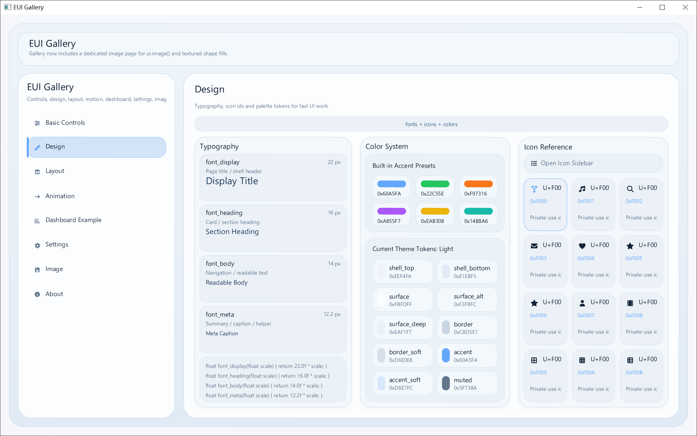
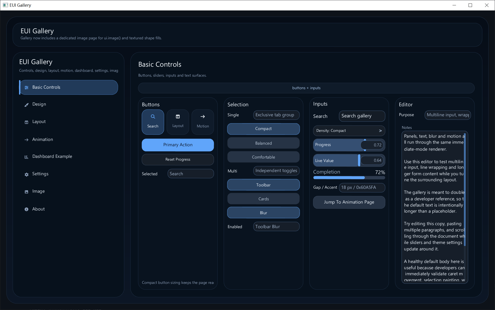
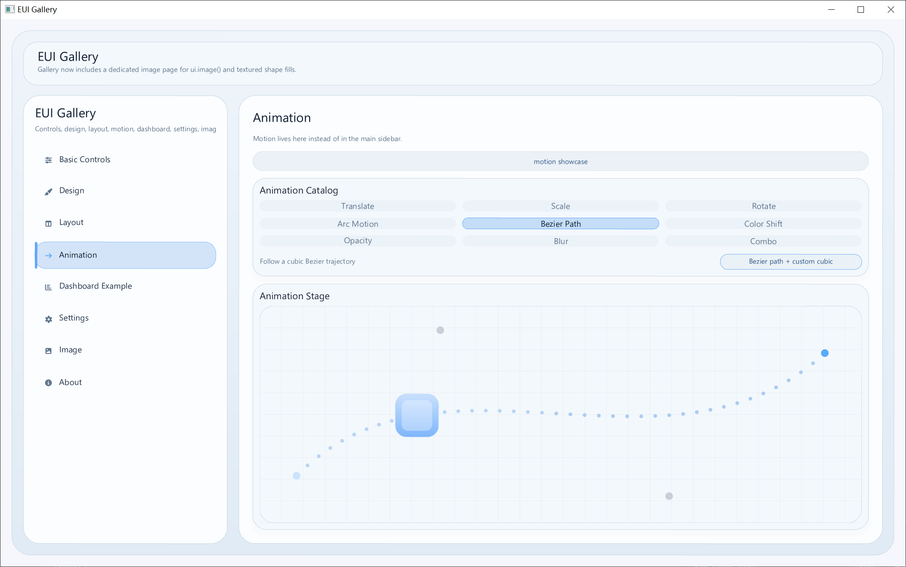
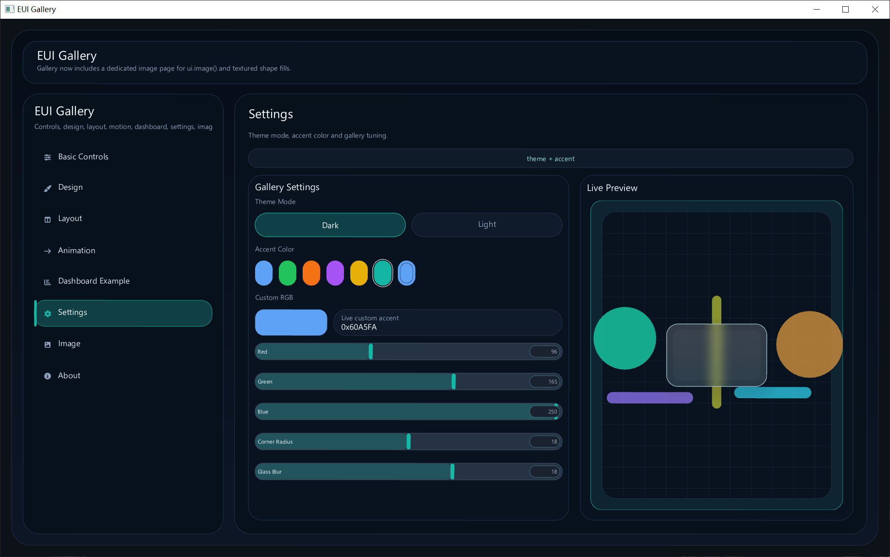

# EUI

Immediate-mode C++ UI toolkit with a unified OpenGL renderer path for `GLFW` and `SDL2`.

## Preview

<table>
  <tr>
    <td></td>
    <td></td>
    <td></td>
  </tr>
  <tr>
    <td></td>
    <td></td>
    <td></td>
  </tr>
</table>

## Docs

- `docs/quick-ui-tutorial.zh-CN.md`
- `docs/project-structure.zh-CN.md`
- `docs/README.md`

## Examples

- `examples/minimal_quick_demo.cpp`
- `examples/anchor_and_position_demo.cpp`
- `examples/image_texture_demo.cpp`
- `examples/EUI_gallery.cpp`
