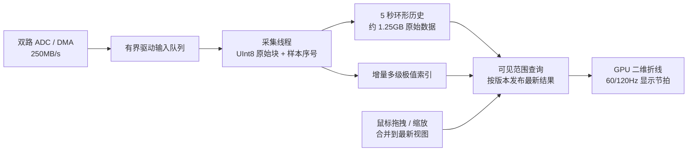

# 双路 125MS/s、250MB/s 波形测试与方案

日期：2026-09-19。用户确认：双路 8 位，每路 125MS/s，保留最近 5 秒原始数据，
二维折线视口查看约 65,536 点/路，支持持续拖拽和缩放。

## 结论

**现有 `Plot` 原样不能满足稳定 60Hz 的目标，也不能直接作为 250MB/s 采集存储层。**
将采集存储与显示分离后，实验程序能在本机按约 250MB/s 接收模拟输入、保留 5 秒原始数据；
用保峰值索引提取显示点后，刷新接近 60Hz，但 2× 的 P95/P99 仍超过 16.7ms。
因此结论是“架构可行，专用波形路径值得实现”，不是“当前模块已完整达标”。

本次只新增实验程序与报告，**没有把实验存储、LOD 或线程模型接入生产 `Plot`/gallery**。
原始点拾取、触发采集、设备驱动、长期无丢包及端到端鼠标延迟仍需后续集成验证。

## 需求换算

MB/GB 均按十进制计算，Byte 与 bit 不混用。

| 项目 | 数值 |
| --- | --- |
| 输入负载 | 2 × 125,000,000 × 1 Byte = 250,000,000 Byte/s |
| 单路采样间隔 | 8ns |
| 65,536 原始点/路覆盖时间 | 524.288µs，约 0.524ms |
| 一块双路 65,536 点 | 131,072 Byte；约每 524µs 到达一块 |
| 采集块频率 | 约 1907.35 块/s |
| 保留 5 秒 | 625,000,000 点/路，合计 1,250,000,000 Byte |
| 60Hz 显示每帧期间的新数据 | 约 4.17MB、31.79 个采集块 |
| 全部展开为现有 `Point{double x,y}` | 原始载荷的 16 倍，5 秒约 20GB，尚未包含中间数组和索引 |

65,536 点是详细视图的一段历史，而不是 5 秒的全部原始点。若将整整 5 秒概览压缩到
65,536 个显示位置，平均每个位置覆盖约 9537 个原始样本，必须使用保峰值聚合并可回到原始值。

## 环境与方法

- Windows 11、Intel Core i7-12650H、NVIDIA RTX 4060 Laptop GPU；OpenGL + GLFW。
- MinGW GCC 15.2.0，Release，项目采用 `-Os`。本次未改变生产编译选项。
- 1920×1080 逻辑布局，分别测试绘图区 1×/2× 输出纹理；2× 是更高的离屏纹理分辨率，
  窗口呈现仍为 1920×1080，不代表验证了真实 4K 显示器。
- 64MiB 预生成、循环使用的双路 UInt8 输入，包括不同周期斜坡、伪随机扰动和孤立极值。
  独立生产线程按 250MB/s 调度，复制全部输入并生成增量极值索引；使用 Windows 高分辨率等待定时器。
- 每组接收约 10.2 秒：先装满 5 秒历史，再同时输入、覆盖环形缓存和进行约 5.2 秒的 UI 测量。
  每组总计 2,550,136,832 Byte；保留 9537 块，共 625,016,832 点/路，略多于 5 秒。
- 显示取历史缓存中部的窗口，基准位于初始 65,536 点附近；拖拽与滚轮交替，每秒切换。
  实际可见 X 范围约 55,000–76,000 点，程序记录 min/max。
- 按 1000Hz 时间线向 Runtime 注入合成鼠标移动事件；滚轮阶段同时注入小幅滚动。
  事件在每帧批量送入，Runtime 会合并连续移动，**不是物理鼠标的每毫秒响应测量**。
  断言拖拽和缩放均确实改变相机轴范围，不能把仅注入事件当作完成交互。
- 包含数据准备、Runtime 输入、真实 `Plot::compose`、UI 绘制、present 和 `glFinish`。
  关闭 VSync，以 60Hz 的软件节拍刷新，卡顿时不堆积过期帧。
  表中“帧耗时”不包含主动等待下次刷新，“观察刷新率”包含调度等待。
- 首次字体/着色器初始化不计入持续交互统计；原实现独立基准另记录首次绘制时间。

输入生成、所有权管理和历史缓存是实验适配层，两种显示方式共用它。
“现有显示”每次从历史取 65,536 点/路转为 `Data`，仍走现有全部几何/索引流程；
“索引原型”按当前可见范围生成少量带原始序号的极值点，再转为现有 `Plot` 绘制。
两者不保证完全相同的边界像素，也没有把整个 5 秒原始历史交给现有 `Data`。

这些是内存模拟结果：没有经过 PCIe/USB/网络、真实 DMA 或存盘。模拟生产者可在调度延误后追赶，
所以不能据此声称硬件连续采集绝不丢样，也不能将平均接收速率当作峰值吞吐余量。

## 最终核验结果

最终四组均正常退出：输入及最终保留的原始块通过逐字节比较；历史块序号连续，保留长度正确；
缓存池无耗尽；拖拽/缩放均有实际轴变化。之前未完整验证释放事件的试跑不纳入下表。
原始记录见 [plot-throughput-baseline.json](plot-throughput-baseline.json)。

| 显示路径 | DPI | 接收 MB/s | 实际刷新/s | 帧中位数 ms | P95 ms | P99 ms | 超 16.7ms 帧数 |
| --- | ---: | ---: | ---: | ---: | ---: | ---: | ---: |
| 现有 Plot + 原始窗口 | 1× | 249.998 | 44.60 | 22.08 | 27.89 | 32.03 | 232/232 |
| UInt8 极值索引原型 + Plot | 1× | 250.002 | 59.68 | 12.26 | 15.58 | 18.89 | 8/310 |
| 现有 Plot + 原始窗口 | 2× | 249.995 | 44.97 | 21.13 | 27.86 | 31.90 | 233/233 |
| UInt8 极值索引原型 + Plot | 2× | 249.988 | 58.90 | 15.69 | 18.46 | 22.02 | 42/306 |

250MB/s 附近的微小差异来自有限测量长度、块边界和调度。测试期间没有漏处理计划内的模拟输入块。
界面跳过了约 9600 个已被后续块替代的显示更新；这不是丢失原始采集数据，原始块仍按 5 秒保留策略进入缓存。

原型 1× 最长帧 35.73ms，2× 最长帧 24.50ms，**不能宣称无卡顿或稳定 60Hz**。
生产线程每块处理耗时中位数约 0.35ms，对比到达周期 0.524ms，说明仍需要处理调度抖动和突发。
最终运行中最大源调度落后 4.38ms，约对应 1.1MB 输入数据；真实系统必须配置独立驱动/DMA 队列。

`GL_TIME_ELAPSED` 记录的绘制区间中位数约 0.73–1.69ms；它不是 GPU 占用率，
也不能简单从帧时间相减得出纯 CPU 忙碌时间。结合遍历代码和帧耗时，当前优先瓶颈是 CPU 路径。
原型事件计划到派发的 P95 约 17ms；这不包含设备传输、显示器扫描或实际光子输出。

原始块、3 级索引和 256 个备用块的固定载荷预算约 **1.348GB**。
该数值不包含输入样板、容器/共享引用元数据、临时 XY、字体、GPU 纹理和分配器开销，不能当作进程峰值内存。
生产方案建议初步按 **1.5–2GB 内存预算**设计，再用真实进程指标验收。

## 全历史缩放与原始细节

索引按每 256 样本为叶子，在 4096 和 65,536 样本层级汇总极小/极大值及原始索引。
每屏幕列查询首、末、最小和最大样本，再按原始序号连成二维折线；不对原始存储做均值覆盖。
窄视图直接返回逐个原始样本。2000 组随机区间与暴力查询对照，验证极值及位置；
历史查询输出逐点回查原始缓存，128 点细节测试保持全部原始点。

以下是采集结束后、保留 5 秒历史上每档 32 次查询的中位数，**仅包含提取显示点，不包含完整绘制**：

| 可见原始点/路 | 1× 查询 ms | 2× 查询 ms |
| --- | ---: | ---: |
| 128 | 0.0057 | 0.0057 |
| 65,536 | 0.782 | 1.028 |
| 1,250,000（10ms） | 4.072 | 8.135 |
| 125,000,000（1s） | 5.272 | 10.149 |
| 625,000,000（5s） | 5.732 | 11.281 |

完整 5 秒、2× 概览只提交约 30,716 个显示点（双路合计）。极值索引避免每帧扫描 12.5 亿原始样本。
但本实验未证明完整 5 秒视图在持续采集下的端到端 P99 达标，也未做逐像素保峰值截图验证。

## 推荐实现方案



1. **专用等间隔 UInt8 存储。** 建立 `SampledSignal`/`WaveformBuffer`，记录采样率、起始时间、
   64 位绝对样本序号和两个 8 位通道。X 从序号计算，不为每点存 double X/Y。
   固定块池和有界队列；发布不可变块，禁止写线程覆盖 UI 仍读取的块。生产目标可预留
   16–64MB 驱动输入缓冲，具体按设备的突发和阻塞上限确定。
2. **采集与显示解耦。** 所有输入块进入 5 秒历史，UI 每个显示周期只消费最新完成的视图。
   拖拽和滚轮合并成最新请求，旧的耗时查询可取消；不要把每秒 1907 次块到达都映射为 UI 重绘。
   滚动采集视图与冻结回看视图分开；历史到期明确显示过期范围，不静默显示错误时刻。
3. **增量保峰值索引。** 每块只构建一次多级 min/max，并保留峰值位置；按视口物理像素列查询。
   放大后直接绘制原始值，拾取用样本序号回查，不将摘要点序号当作原始序号。
   原型中 `Sample.index` 正确保留来源，但接入通用 `Plot` 后的交互拾取仍是缩减 `Data` 的索引，
   这一点必须在生产 API 中补齐。
4. **绕过通用 Plot 的重复工作。** 单独实现二维 `WaveformPlot`，复用现有 UI 坐标轴、纹理合成与输入。
   已知固定范围不反复 `Axes::fit()` 扫描；按等间隔 X 直接定位样本，取消整窗 `PointIndex` 重建；
   显示结果直接进入复用的 GPU 顶点缓冲，避免第二次 `Data` 展开和显示选样。
   使用批量线段/屏幕线宽三角形，保持二维折线，避免逐点 UI 元素。
5. **预算与异常。** 固定块池、查询结果和 GPU 缓冲都有上限；驱动队列溢出应记录缺失区间和计数，
   禁止把断档连成连续折线。查询只固定所需历史块，减少原型当前“复制整个历史引用列表”的开销。
   对 8 位归约内核单独评估 `-O3`/SIMD，并在相同数据和正确性条件下复测，不默认换整库编译策略。

最小落地顺序：UInt8 环形缓冲与输入队列 → 增量索引与原始拾取 → 专用二维视口 → 真采集设备验收。
不建议把所有数据上传 GPU，或先将 5 秒数据全部转换成现有 double XY；本机当前工作空间也不足以
安全承载全量 double XY 与全部额外索引，本次没有尝试用换页制造“勉强成功”的结果。

## 生产验收建议

- 驱动实测持续 250MB/s 至少 30 分钟，统计序号缺口、CRC/校验、队列峰值、真实端到端采样延迟。
- 5 秒历史满载、覆盖、暂停/恢复和历史过期期间，双路源样本拾取及 8ns 时间定位保持正确。
- 1×/2×、65,536 点详细视图与 5 秒概览、极端高频/稀疏尖峰分别验证；建议 60Hz 档
  P99 帧处理 ≤16.7ms，另单独记录输入到呈现延迟。120Hz 需要另设 ≤8.33ms 目标，本次未证明。
- 加入长时间进程内存/显存/句柄曲线以及突发输入，不能以短时平均速率或固定载荷预算替代。

## 复现

```powershell
cmake -S . -B build -DEUI_BUILD_TEST_FIXTURES=ON
cmake --build build --target plot_throughput_probe --parallel 6
ctest --test-dir build -R '^plot_throughput_probe$' --output-on-failure
./build/plot_throughput_probe.exe --baseline
./build/plot_throughput_probe.exe --history
```

默认 CTest 只执行确定性的极值/原始点正确性测试，不自动申请 1.35GB 或运行约 45 秒的窗口压力测试。
`--history` 才是本需求的四组真实窗口实验；`--stream` 只保留最新 65,536 点，不能替代 5 秒历史验收。
测试代码位于 `tests/probes/plot_throughput_probe.cpp` 和 `tests/probes/plot_stream_experiment.h`。
